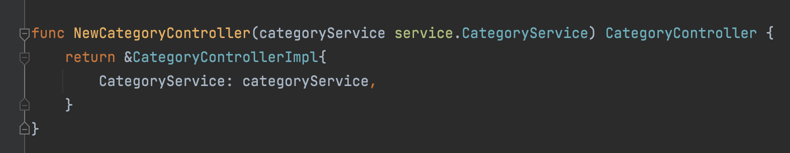
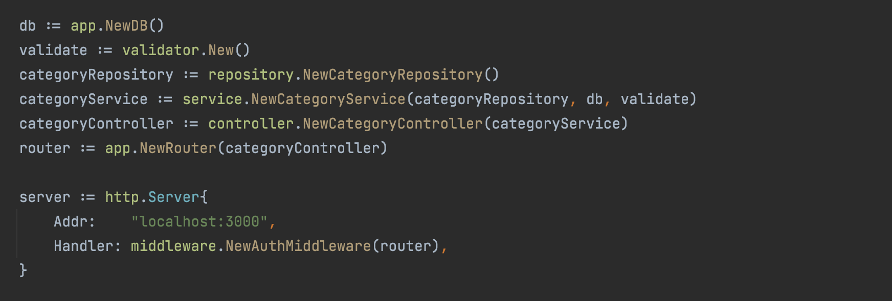

# Dependency Injection

- Dalam pembuatan perangkat lunak, Dependency Injection merupakan sebuah teknik dimana sebuah object menerima object lain yang dibutuhkan (dependencies) ketika pembuatan object itu sendiri
- Biasanya object yang menerima dependencies disebut client, proses mengirim dependencies ke object tersebut biasa dibilang inject
- Dependency Injection sebenarnya sudah sering sekali kita lakukan, misal membuat object Controller yang membutuhkan dependencies object Service, atau membuat object Service yang membutuhkan dependencies object Repository

## Function Sebagai Constructor (1)

- Dalam bahasa pemrograman berorientasi object, ada istilah yang bernama Constructor, yaitu sebuah function yang digunakan ketika sebuah object dibuat
- Di Go-Lang, biasanya kita juga membuat sebuah function untuk membuat object, dan ini mirip seperti Constructor tugasnya, yaitu membuat object baru 

## Function Sebagai Constructor (2)

- Biasanya kita akan membuat object dengan memanggil function Constructor tersebut, lalu mengirimkan dependencies yang dibutuhkan pada function Constructor tersebut
- Cara seperti ini mudah dilakukan ketika kode program aplikasi kita tidak terlalu besar 
- Namun saat kode program aplikasi kita semakin besar, akan semakin sulit melakukan hal ini, terutama kita harus tahu urutan object mana yang harus dibuat terlebih dahulu 
- Oleh karena ini, proses Dependency Injection sebenarnya bisa kita permudah dengan memanfaatkan library 

# Library Dependency Injection

- Banyak sekali library Dependency Injection yang bisa kita gunakan di Go-Lang, misalnya
- https://github.com/google/wire  
- https://github.com/uber-go/fx  
- https://github.com/golobby/container  
- Dan lain-lain 

## Google Wire

- Pada kelas ini, kita akan menggunakan Google Wire sebagai Dependency Injection library nya
- Salah satu kenapa Google Wire menjadi pilihan, karena saat ini Google Wire adalah library paling populer untuk melakukan Dependency Injection di Go-Lang 
- Selain itu, Google Wire merupakan library Dependency Injection yang berbasis compile, artinya kodenya akan di generate, bukan menggunakan reflection 
- Hal ini membuat Google Wire menjadi cepat, karena hasil kompilasi nya adalah kode yang sudah di generate melakukan Dependency Injection, tanpa perlu menggunakan reflection lagi 

